# Gestor de Notas en un Calendario 

## Descripción del Proyecto

En este proyecto se nos proponía crear una página web con HTML, CSS y JavaScript, en la cual debíamos gestionar una agenda de notas con título y descripción. 
Dependiendo del mes del año, aparecen unas notas u otras. 
Además de añadir notas, también es posible editarlas o borrarlas. 
En la página principal se pueden listar todas las notas o eliminarlas.

## Detalles Internos 

Con respecto a la creación de la página, en primer lugar, en el JavaScript de la página principal llamamos a la función init(), que es la encargada de actualizar el contador de notas gracias a la función cargarNotas(), la cual obtiene los datos desde localStorage.

```javaScript
function init() {
    contarNotas();

    btnListar.addEventListener("click", () => {
        listar();
    });

    btnLimpiar.addEventListener("click", () => {
        limpiar();
    });

}
```

Después se encuentran las funciones de los botones:

- Listar, que muestra todas las notas que existan.

```javaScript
function listar() {
    pintarNotas.textContent = "";
    let ok = false;
    for(let i = 0; i < meses.length; i++) {            
        const notaMes = cargarNotas(i + 1);
        if(notaMes.length > 0) {
            ok = true;
            for(let j = 0; j < notaMes.length; j++) {
                const li = document.createElement("li");
                li.textContent = `Mes: ${nombresMeses[i]} - ${notaMes[j].titulo}: ${notaMes[j].descripcion}`;
                pintarNotas.appendChild(li);
            }
        } 
    }
    if (!ok) {
        mostrarMensaje("No hay notas disponibles");
    }
    contarNotas();
}
```

- Limpiar, que, a diferencia de Listar, borra todas las notas existentes.

```javaScript
function limpiar() {
    let ok = false;
    if(!confirm("¿Estás seguro de borrar todas las notas?")) {
        return false;
    }
    pintarNotas.textContent = "";
    for(let i = 0; i < meses.length; i++) {
        const clave = "nota" + (i + 1);
        if(localStorage.getItem(clave) !== null) {
            localStorage.removeItem("nota" + (i + 1));
            meses[i].textContent = 0;
            ok = true;
        }
    }
    if(!ok) {
        mostrarMensaje("No tienes ninguna nota para borrar");
    }
    contarNotas();
}
```

En cuanto a la página de cada mes, tenemos otra función init() encargada de colocar el nombre correspondiente al mes, por ejemplo, Notas de Enero.

```javaScript
function init() {
    const params = new URLSearchParams(window.location.search);
    const mes = Number(params.get("mes"));
    tituloHead.textContent = "Notas de " + nombresMeses[mes - 1];
    notasMeses = "nota" + mes;
    notas = cargarNotas();

    render();

    btnAgregar.addEventListener("click", () => {
        if(!validad()) {
            return;
        }
        insertarNota();
    })
    
}
```

Posteriormente, se cargan las notas existentes utilizando nuevamente localStorage. 

```javaScript
function cargarNotas() {
  const raw = localStorage.getItem(notasMeses);

  if (!raw) return [];

  try {
    const data = JSON.parse(raw);
    return Array.isArray(data) ? data : [];
  } catch (error) {
    alert("JSON inválido:", error);
    return [];
  }
}
```

Después encontramos el botón Agregar nota, que requiere una validación antes de enviarse.

```javaScript
function validad() {
    if(!inpTitulo.checkValidity()) {
        mostrarMensaje("Debes colocar un título de mínimo tres caracteres");
        return false;
    }
    if(!inpDescripcion.checkValidity()) {
        mostrarMensaje("Debes colocar una descripción de mínimo tres caracteres");
        return false;
    }
    return true;
}
```

Una vez validada, la nota se inserta y se muestra en pantalla.

```javaScript
function pintarListaNotas() {
    listaNotas.textContent = "";
    for(let i = 0; i < notas.length; i++) {
        const div = document.createElement("div");
        const li = document.createElement("li");
        const borrar = document.createElement("button");
        const editar = document.createElement("button");

        li.textContent = notas[i];
        borrar.textContent = "Borrar";
        editar.textContent = "Editar";

        listaNotas.appendChild(div);
        div.appendChild(li);
        div.appendChild(borrar);
        div.appendChild(editar);

        li.innerHTML = `Título: ${notas[i].titulo}<br>
        Descripción: ${notas[i].descripcion}<br>`;

        borrar.addEventListener("click", () => borrarNota(i));
        editar.addEventListener("click", () => editarNota(i));
    }
}
```

Por último, cada nota tiene dos botones:


- Borrar, que elimina esa nota concreta.

```javaScript
function borrarNota(indice) {
     if(!confirm("¿Estás seguro de borrar esta nota?")) {
        return false;
    }
    notas.splice(indice, 1);
    localStorage.setItem(notasMeses, JSON.stringify(notas));
    render();
}
```
  
- Editar, que coloca en los campos del formulario los datos de esa nota para poder modificarlos. Sin embargo, si se vuelve atrás durante el proceso de edición, se perderá la nota, ya que técnicamente se elimina cada vez que se comienza a editar.

```javaScript
function editarNota(indice) {
    const editNota = notas[indice];
    inpTitulo.value = editNota.titulo;
    inpDescripcion.value = editNota.descripcion;

    notas.splice(indice, 1);
    localStorage.setItem(notasMeses, JSON.stringify(notas));

    render();
}
```

## Instrucciones de Uso

Al entrar en la página, podemos observar un calendario con los 12 meses del año y dos botones: Listar y Limpiar.

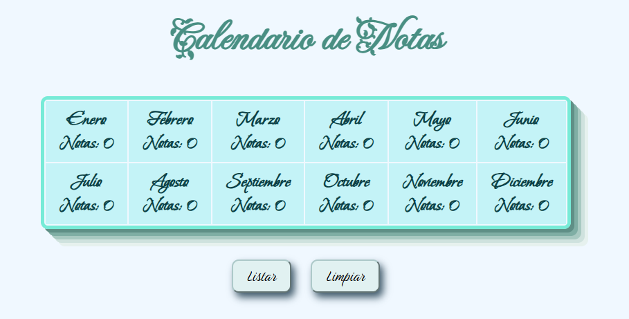

Si pulsamos sobre ellos, aparecerá un mensaje indicándonos que es necesario introducir al menos una nota antes de poder utilizar ambos botones.

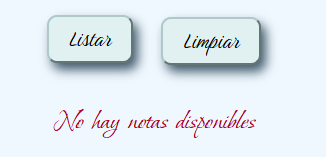
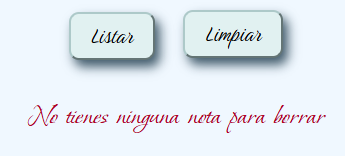

Por lo tanto, debemos introducir una nota. Para ello, hacemos clic en cualquiera de los meses del calendario.
Una vez dentro, introducimos los campos que deseemos.

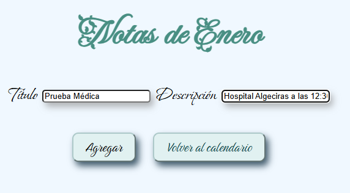

Debemos tener en cuenta que cada campo no puede estar vacío y debe contener al menos 3 caracteres, ya que no tendría mucho sentido crear notas de uno o dos caracteres.

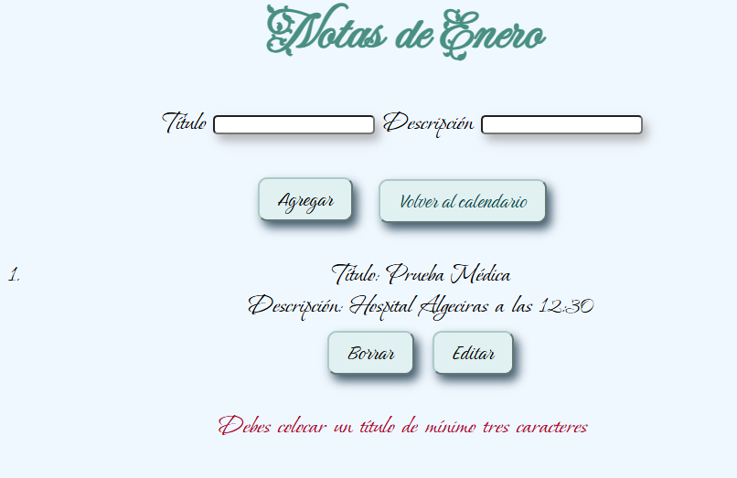


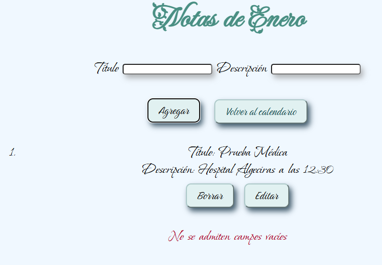

Si deseamos editar una nota, pulsamos el botón Editar y realizamos las modificaciones necesarias.

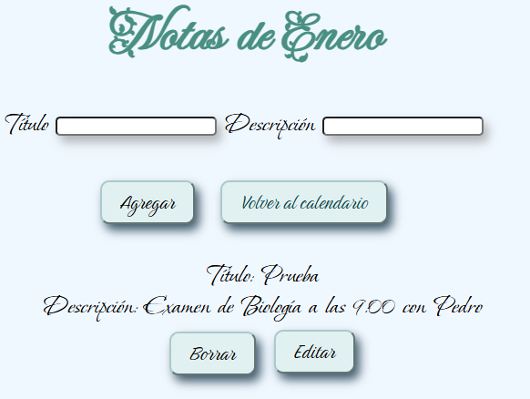


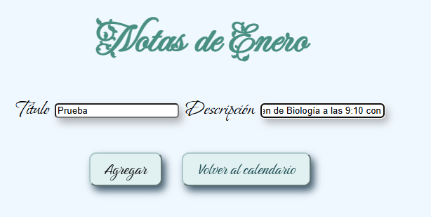

También podemos borrar la nota si así lo deseamos pulsando el botón Borrar y te preguntará si estas de acuerdo con borrarla

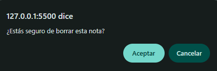

Cuando terminemos de introducir las notas que queramos, podemos volver atrás utilizando el botón Volver al calendario.
Al regresar al calendario, veremos que el mes de Enero aparece con un color más claro. Esto indica que existe al menos una nota en ese mes. A partir de ese momento, los botones Listar y Limpiar estarán disponibles.

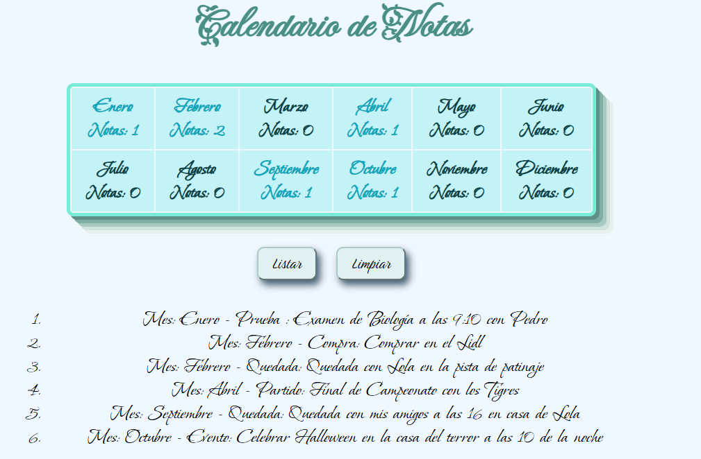

Debemos tener en cuenta que, si pulsamos Limpiar, aparecerá un aviso preguntándonos si realmente deseamos borrar todas las notas almacenadas.

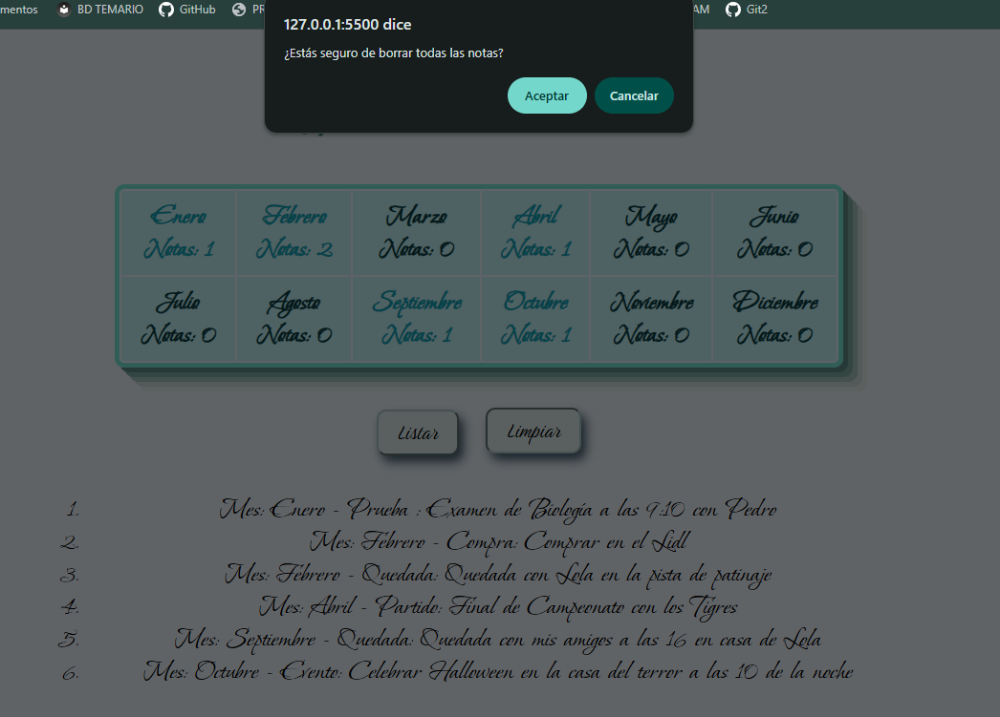


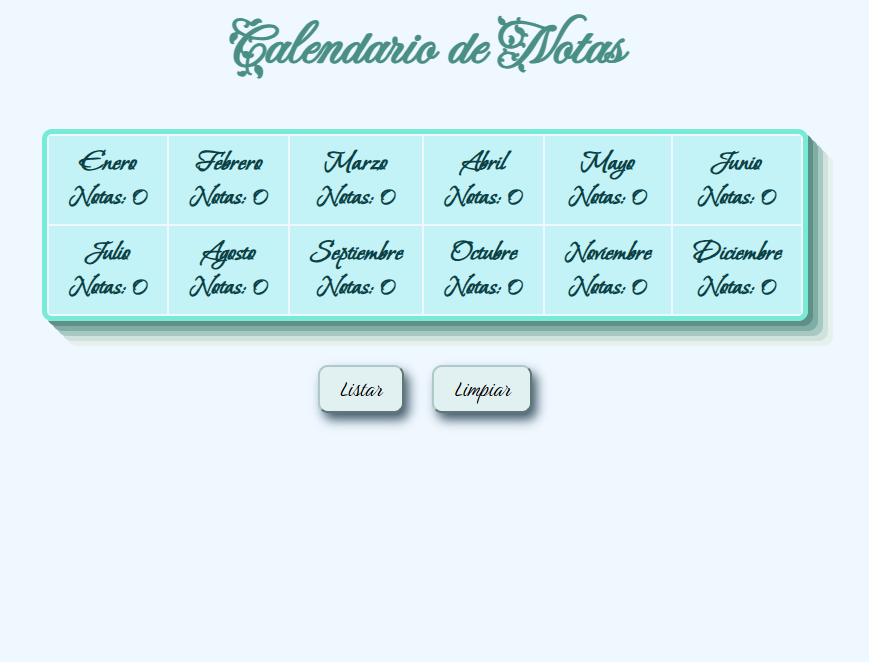

